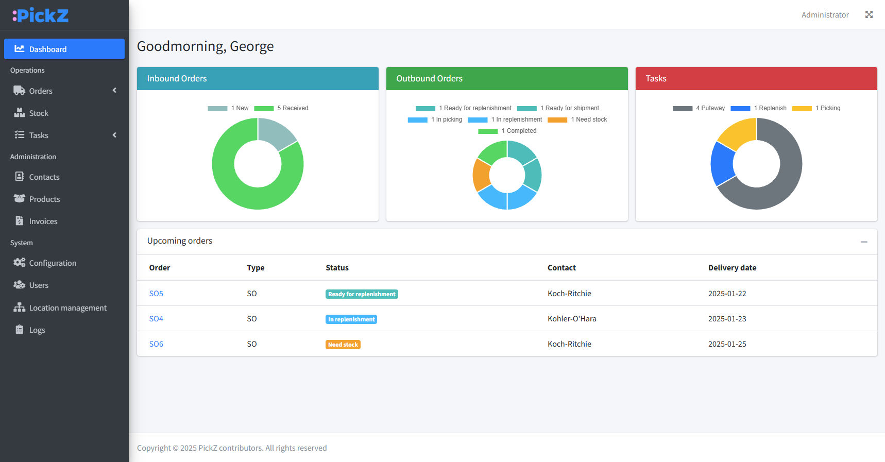

<h1 align="center">
    
</h1>

<p align="center">
    <i>PickZ is an open source warehouse management system designed to streamline warehouse operations in small to medium-sized environments.</i>
</p>

<p align="center">
  <a href="https://www.pickz.org" target="_blank">Website</a> |
  <a href="https://docs.pickz.org" target="_blank">Documentation</a> |
  <a href="https://demo.pickz.org" target="_blank">Demo</a> |
</p>

<h4 align="center">
    
    
</h4>

<p align="center">

</p>

## Features

📦 **Smart inventory management:** track inventory in real-time.

📄 **Seamless order handling:** manage inbound and outbound orders.

🧭️ **Guided putaway:** use guided instructions for efficient storage.

📲 **Handheld scanner support:** use handheld scanners for quick, accurate tasks.

📅 **FEFO picking:** pick items using the first expired, first out method.

🧐 **Dynamic stock grouping:** organize stock any way you want.

🔖 **Task and location priorities:** prioritize tasks and locations to optimize operations.

❌ **Crossdocking:** improve efficiency with crossdocking capabilities.

💵 **Invoicing:** invoicing based on quantities and stay duration.

👥 **User & roles management:** manage users and roles.

## Requirements

* PHP ^8.2
* Composer ^2.6

Alternatively, you can use [Docker](https://www.docker.com/) to run the application.

## Installation

Clone or extract files into a folder and run:

```
composer install -o --no-dev
```

There is a .env.example which is a template of the .env file that the project expects us to have.
So we will make a copy of the .env.example file and create a .env file that we can start to fill out to do things like
database configuration in the next few steps.

```
cp .env.example .env
```

Now change the variables in the .env file for your database, timezone, and app URL.

### Application settings

`APP_TIMEZONE` Application timezone \
`APP_URL` Application URL

### Database settings

`DB_CONNECTION` Database type \
`DB_HOST` IP or hostname \
`DB_PORT` Port \
`DB_DATABASE` Database name \
`DB_USERNAME` Username \
`DB_PASSWORD` Password

Run these commands to generate an app encryption key and set up the initial database tables and records.

```
php artisan key:generate
php artisan migrate --force
php artisan db:seed --force
```

Finally, don't forget to add a cron entry to your server for scheduled tasks.

```
* * * * * cd /path-to-PickZ && php artisan schedule:run >> /dev/null 2>&1
```

PickZ should now be ready to run!\
The default username/password is admin/admin, make sure to immediately change this after logging in the first time.

## Docker installation

To install and run PickZ using Docker, follow these steps:

1. **Clone the repository:**

    ```sh
    git clone https://github.com/PickZ-org/PickZ.git
    cd PickZ
    ```

2. **Copy the `.env.example` file to `.env` and update the environment variables as needed:**

    ```sh
    cp .env.example .env
    ```

3. **Build and start the Docker containers:**

    ```sh
    docker-compose up --build -d
    ```

4. **Install PHP dependencies using Composer inside the Docker container:**

    ```sh
    docker-compose exec app composer install -o --no-dev
    ```

5. **Generate the application key:**

    ```sh
    docker-compose exec app php artisan key:generate
    ```

6. **Run database migrations and seeders:**

    ```sh
    docker-compose exec app php artisan migrate --force
    docker-compose exec app php artisan db:seed --force
    ```

PickZ should now be ready to run!\
The default username/password is admin/admin, make sure to immediately change this after logging in the first time.

## Built with

This project wouldn't exist without the help of:

* [Laravel](https://laravel.com/)
* [AdminLTE](https://adminlte.io/)
* [Bootstrap](https://getbootstrap.com/)
* [DataTables](https://datatables.net/)

## Contributing

Contributions are always welcome!

See [Contributing](CONTRIBUTING.md) for ways to get started.

Please adhere to this project's [Code of conduct](CODE_OF_CONDUCT.md).

## License

PickZ is distributed under the [AGPLv3](https://www.gnu.org/licenses/agpl-3.0.en.html) license.

